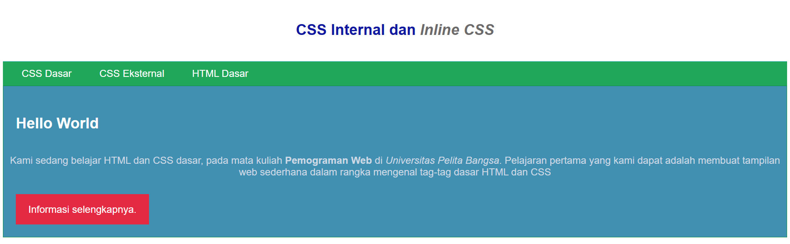

## Praktikum 3: CSS Dasar ##

Berikut hasil praktikum saya pada praktikum 3: CSS Dasar

## 1. Membuat dokumen HTML
Seperti yang sudah dipelajari di praktikum 1 & 2, saya membuat sokumen html yg memiliki struktur : doctype html, head, dan juga body. 

## 2. Mndeklarasi CSS Internal
CSS Internal itu style/mengubah tampilan pada html yang tadinya flat hanya tulisan hitam dengan background putih, kita bisa memberikan warna pada tampilan html tersebut yang ditulis pada bagian head. 

## 3. Menambahkan Inline CSS
Inline CSS hanya mengubah pada bagian yang ditulis, yang diperintahkan pada praktikum itu bagian < p > maka yg berubah hanya bagian paraghraf.

## 4. Membuat CSS Eksternal
CSS Eksternal itu membuat css di luar file dokumen html. Untuk menghubungkan file css eksternal dengan dokumen html, kita menambahkan link pada dokumen html

## 5. Menambahkan CSS Selector
CSS Selector itu dapat berupa elemen html, selector class atau selector id. Kalau elemen html itu dia tidak menggunakan tanda khusus, sedangkan selector class itu memiliki tanda < . > dan selector id itu memiliki tanda < # > sebelum menuliskan nama class/ id yang ingin digunakan.

Berikut lampiran-lampiran praktikum saya pada praktikum 3 :

